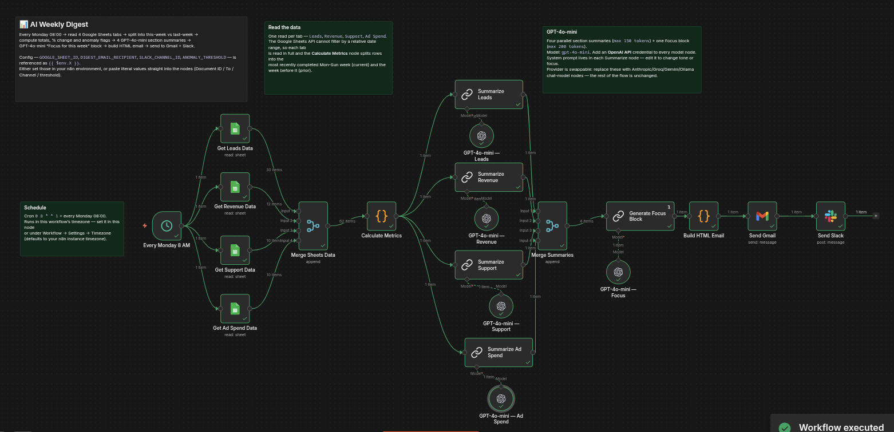
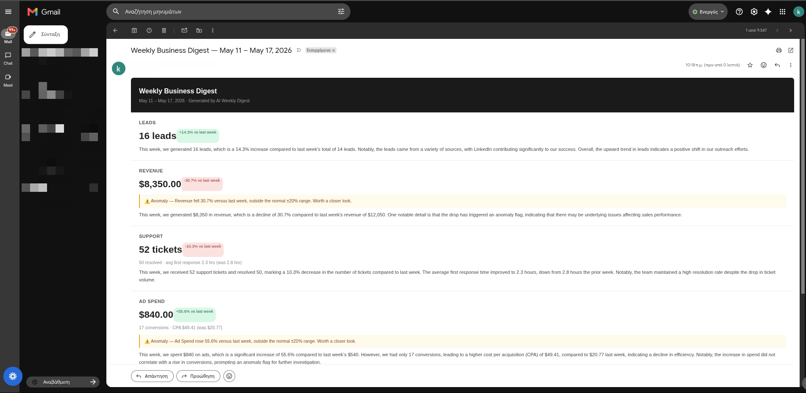
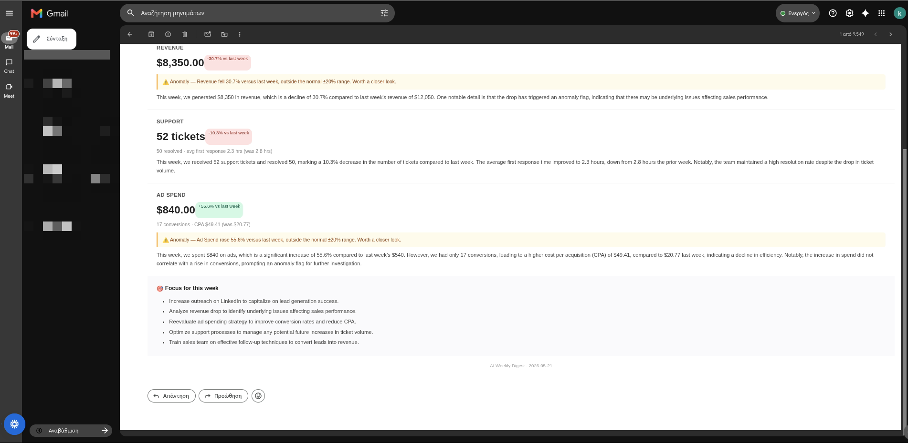
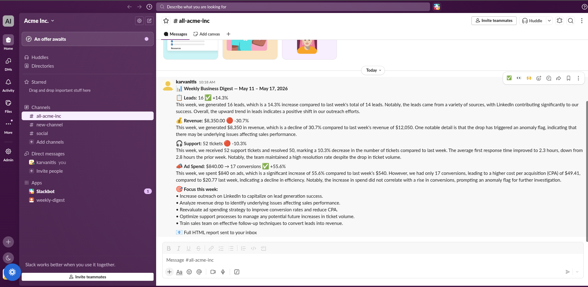

# 03 — AI Weekly Digest

> **Replaces the Monday-morning reporting ritual** — the ~1 hour someone spends every week
> pulling numbers from spreadsheets, writing up what changed, and emailing it around. That's
> roughly **50+ hours a year** of a manager's or analyst's time, gone. The automation reads
> the numbers, writes the summary, flags what moved, and delivers it to email **and** Slack
> before anyone logs on.

## What it does

Every Monday morning someone on your team opens a handful of spreadsheets, copies last
week's numbers into a document, writes a few sentences about what changed, notices (or
misses) that one of them moved a lot, and emails it around. It takes the better part of an
hour and it happens 52 times a year. This automation does the whole thing while everyone
is still asleep.

It reads the numbers you already track — leads, revenue, support tickets, ad spend — from
a Google Sheet, compares this week to last week, writes a short plain-English summary of
each area, flags anything that moved more than it should have, and turns it into a clean
weekly report. The report lands as a formatted email in your inbox and as a short, scannable
message in Slack — both waiting for you at the start of the week, with a short "focus for
this week" list built from whatever actually changed.

## Demo

### n8n workflow canvas

*Scheduled trigger → four Google Sheets reads → metric calculation → per-section AI summaries → focus block → HTML email + Slack.*

### HTML email digest in Gmail

*Each section shows the headline number, the week-over-week change, a plain-English summary, and an amber anomaly box when something moved more than 20%.*

### "Focus for this week" action block

*The AI turns the week's anomalies into a short, prioritised action list — grounded in what actually changed, not generic advice.*

### Slack digest

*The same report condensed into a scannable Slack message for the whole team.*

## What gets reported

| Section | Metric | Anomaly triggers when |
|---|---|---|
| Leads | Total leads this week | Change > 20% vs prior week |
| Revenue | Total revenue ($) | Change > 20% vs prior week |
| Support | Total tickets + total resolved + average first-response time | Change > 20% vs prior week (on tickets) |
| Ad Spend | Total spend + conversions + CPA | Change > 20% vs prior week (on spend) |

The 20% figure is the default — it is the `ANOMALY_THRESHOLD` value (an env var, or a
literal you set in the `Calculate Metrics` node) and can be changed to anything.

## Anomaly detection

Anomaly detection is the part that makes the digest worth reading even on a quiet week. For
each section the workflow computes the percentage change versus the prior week; if the
absolute change exceeds the threshold, that section gets flagged. A flagged section gets an
amber highlight box in the email and is fed into the "Focus for this week" block so the
recommendation is grounded in what actually moved. For example: if revenue drops 31% versus
last week, the digest flags it in amber, the summary says revenue declined sharply, and the
Focus block includes a line like *"Investigate the revenue drop — review pipeline and
closed deals from last week."* Nothing to chase down on a normal week; an early heads-up on
a bad one.

## Google Sheets setup

The automation reads one spreadsheet with four tabs — `Leads`, `Revenue`, `Support`,
`Ad Spend` — each a flat table with a header row. Create them like this:

1. Create a new Google Sheet.
2. Add four tabs and name them **exactly** `Leads`, `Revenue`, `Support`, `Ad Spend`.
3. In each tab, put the column headers in row 1, exactly as below (capitalisation and
   underscores matter):
   - `Leads`: `Date | Source | Grade | Converted`
   - `Revenue`: `Date | Amount | Product | Channel`
   - `Support`: `Date | Tickets | Resolved | Avg_Response_hrs`
   - `Ad Spend`: `Date | Platform | Spend | Clicks | Conversions`
4. Use `YYYY-MM-DD` for every `Date`, and plain numbers (no `$`, no thousands separators)
   for every numeric column.
5. Copy the spreadsheet ID from the URL — `https://docs.google.com/spreadsheets/d/THIS_PART/edit`
   — you'll need it for the four `Get … Data` nodes (see Setup below).

Full column-by-column reference and sample rows: [`form/sample_data.md`](form/sample_data.md).

## Setup instructions

Works on any n8n instance — self-hosted, Docker, or n8n Cloud. No special infrastructure
needed; just import the workflow and fill in your credentials.

1. In n8n: **Workflows → Import from File** → select `workflows/AI Weekly Digest.json`.
2. Add the credentials (in **Credentials → New**) and attach each to the relevant nodes —
   **n8n stores these in its own credential vault; they are not read from any file**:
   - **Google Sheets OAuth2** → the four `Get … Data` nodes
   - **Gmail OAuth2** → the `Send Gmail` node
   - **Slack Bot Token** → the `Send Slack` node (bot scopes: `chat:write`, and
     `chat:write.public` if the bot is not a member of the channel)
   - **OpenAI API key** → the five `GPT-4o-mini — …` model nodes (provider is
     swappable — Anthropic/Groq/Gemini/Ollama drop in via n8n's chat-model nodes)
3. Set the five config values. The workflow ships referencing them as `{{ $env.X }}` —
   pick whichever fits you:
   - **Option A — paste literals into the nodes:** in the four `Get … Data` nodes set
     *Document ID* to your spreadsheet ID; in `Send Gmail` set *To* to your email; in
     `Send Slack` set *Channel* to your channel ID; in `Calculate Metrics` replace
     `$env.ANOMALY_THRESHOLD` with a number (e.g. `20`). No env vars at all.
   - **Option B — keep `$env`:** add `GOOGLE_SHEET_ID`, `DIGEST_EMAIL_RECIPIENT`,
     `SLACK_CHANNEL_ID`, `ANOMALY_THRESHOLD` (and optionally `TIMEZONE` /
     `GENERIC_TIMEZONE`) to your n8n process's environment. See `.env.example` for the
     full list and what each one is.
4. Set the schedule timezone if needed: open the **Every Monday 8 AM** node (or
   *Workflow → Settings → Timezone*) — it defaults to your n8n instance's timezone.
5. Activate the workflow (toggle, top right).
6. To test immediately without waiting for Monday: open the **Every Monday 8 AM** node and
   click **Execute step** (or use **Test workflow** from the canvas).

## Customization

Three things a client can change without touching the workflow logic:

- **Anomaly sensitivity** — change `ANOMALY_THRESHOLD` (env var, or the literal in the
  `Calculate Metrics` node): `15` for twitchier, `30` for calmer. Nothing else changes.
- **Summary tone or focus** — every `Summarize …` node has a system prompt ("You are a
  business analyst writing a concise weekly performance summary…"). Edit it to make the
  summaries more terse, more detailed, more cautious, written for a board vs. an ops lead —
  whatever fits. Same for the `Generate Focus Block` system prompt.
- **A new data source** — duplicate the *read → calculate → summarize* pattern: add a tab,
  copy `Get Leads Data` and point it at the new tab, add a block to `Calculate Metrics`,
  copy `Summarize Leads` with its own OpenAI model node, and reference the new section in
  `Build HTML Email`. Step-by-step in [`form/sample_data.md`](form/sample_data.md).

## Tech stack

| Component | Technology |
|---|---|
| Workflow automation | n8n (self-hosted or Cloud) |
| AI summaries | OpenAI `gpt-4o-mini` (provider-agnostic — swappable for Anthropic/Groq/Gemini/Ollama) |
| Data source | Google Sheets |
| Email delivery | Gmail |
| Team notifications | Slack |

## Adapting to your business

This is a template, not a one-off. If you have weekly numbers living in a Google Sheet, it
fits — just rename the tabs and columns to whatever you track. It works the same for a
**creative or marketing agency** (new business, billings, retainer hours), an
**e-commerce store** (orders, revenue, returns, ad spend), a **SaaS company** (signups, MRR,
support load, paid acquisition), a **real estate team** (listings, viewings, offers, closed
deals), or an **in-house marketing team** (MQLs, pipeline influenced, campaign spend, CPL).

## Known limitations

- Requires Google Sheets as the data source — no direct CRM or database connection in this
  version.
- Anomaly detection is a simple percentage threshold versus the prior week — no statistical
  baseline, seasonality, or trend modelling.
- The model writes its summaries only from the data passed to it; it has no external
  context (industry events, your roadmap, holidays).
- The schedule fires at one fixed time in one timezone — no per-recipient scheduling.

## Contact

Built by Konstantinos Arvanitis — AI engineer & automation specialist.

- [LinkedIn](https://www.linkedin.com/in/karvanitis)
- [GitHub](https://github.com/karvanitis)
