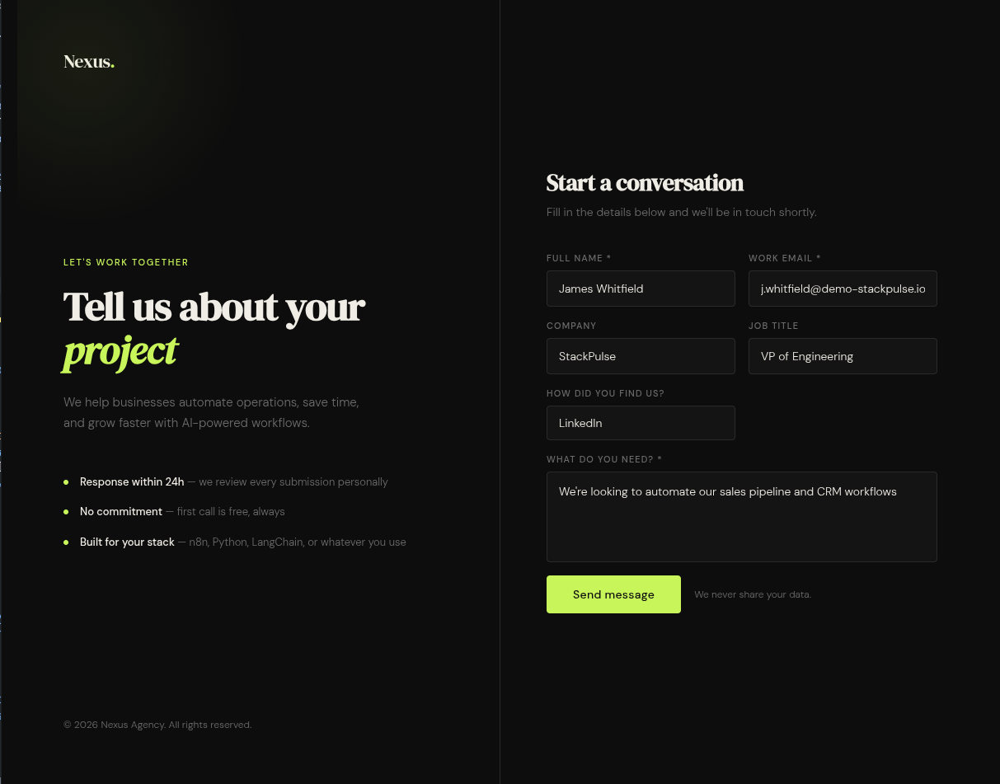
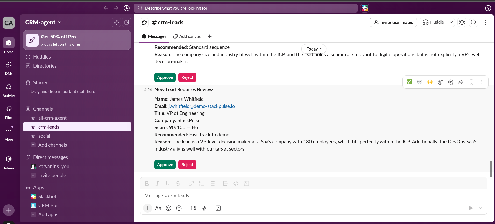
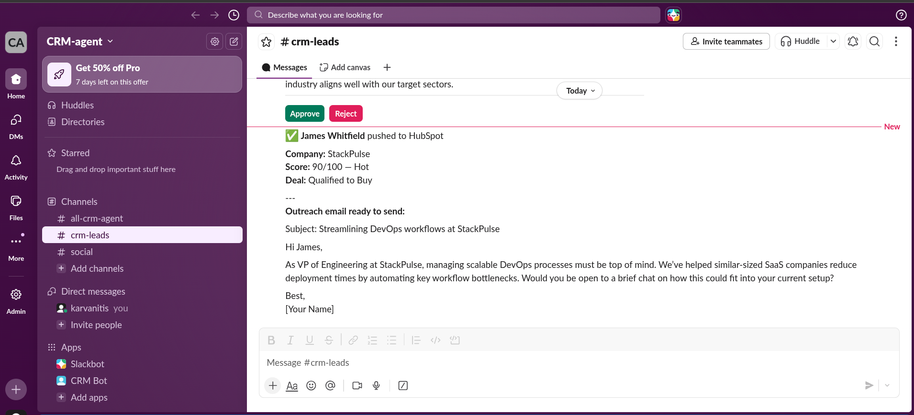
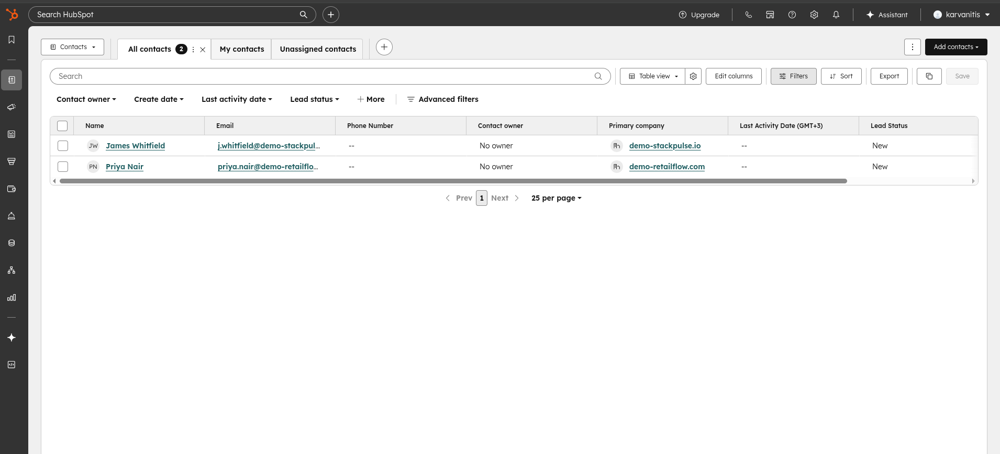
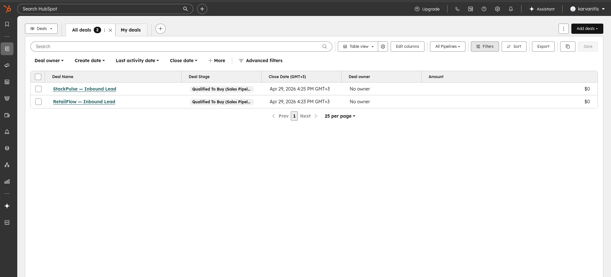
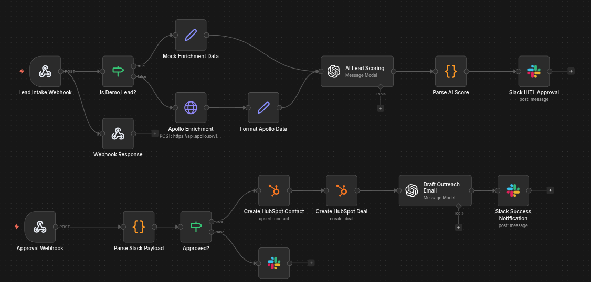

# 02 - AI CRM Pipeline


An end-to-end AI-powered lead qualification and CRM automation pipeline built with n8n. Leads come in through a custom intake form, get enriched and scored against an Ideal Customer Profile using GPT-4.1-mini, go through a human-in-the-loop Slack approval step, and - if approved - automatically create a HubSpot contact, a HubSpot deal, and a personalised cold outreach email draft. All without writing a backend.

---

## How it works

### Workflow 1 - Lead Intake Pipeline

1. **Lead submits the form** - a custom HTML/CSS form (Nexus Agency branding) sends a POST to an n8n webhook
2. **Demo / production check** - an IF node routes demo leads to mock enrichment data; production leads call the Apollo.io People Match API
3. **Data enrichment** - lead is enriched with job title, company, industry, company size, location, and revenue
4. **AI lead scoring** - GPT-4.1-mini scores the lead 0-100 against an Ideal Customer Profile: VP-level or above, SaaS/tech industry, 50-500 employees, US or EU based
5. **Structured output parsing** - a Code node parses the AI response into: score, grade (Hot / Warm / Cold), reason, recommended action, key signal
6. **Slack HITL approval** - a formatted Block Kit message is posted to `#crm-leads` with an **Approve** and a **Reject** button

### Workflow 2 - Approval Pipeline

7. **Button click webhook** - Slack sends the interaction payload to a separate n8n webhook (`/hitl-resume`)
8. **Lead data extraction** - a Code node extracts lead data embedded as a pipe-delimited string in the Slack notification text (this solves cross-workflow data passing since the approval runs in a separate execution context)
9. **Approved path:**
   - Creates a HubSpot contact (first name, last name, email, job title, company, industry, lead status)
   - Creates a HubSpot deal (deal name, stage, close date, estimated amount)
   - Drafts a personalised cold outreach email with GPT-4.1-mini referencing the lead's role, company, and AI key signal
   - Posts the drafted email to Slack for the salesperson to review and send from HubSpot
10. **Rejected path:** posts a rejection notification to Slack with the lead's score

```
[Form Submit]
      │
      ▼
Lead Intake Webhook
      │
      ▼
Is Demo Lead? ──── YES ──→ Mock Enrichment Data
      │                            │
      NO                           │
      │                            │
      ▼                            │
Apollo Enrichment ────────────────→ Format Data
                                        │
                                        ▼
                               AI Lead Scoring (GPT-4.1-mini)
                                        │
                                        ▼
                               Parse AI Score (JSON)
                                        │
                                        ▼
                               Slack HITL Approval (Block Kit)


[Slack Button Click]
      │
      ▼
Approval Webhook (/hitl-resume)
      │
      ▼
Parse Slack Payload
      │
      ▼
Approved? ──── NO ──→ Slack Reject Notification
      │
     YES
      │
      ▼
Create HubSpot Contact
      │
      ▼
Create HubSpot Deal
      │
      ▼
Draft Outreach Email (GPT-4.1-mini)
      │
      ▼
Slack Success Notification (with email draft)
```

---

## Tech stack

| Service | Purpose |
|---------|---------|
| **n8n** | Workflow automation (self-hosted via Docker) |
| **OpenAI GPT-4.1-mini** | Lead scoring + cold email drafting |
| **HubSpot CRM** | Contact and deal creation (Private App Token) |
| **Slack** | HITL approval messages + notifications (Block Kit) |
| **Apollo.io** | Lead data enrichment (People Match API) |
| **ngrok** | Exposes local n8n to the internet for Slack webhooks |

---

## Demo

### Lead intake form


### Slack approval message with Approve / Reject buttons


### Slack success notification with AI-drafted outreach email


### HubSpot contacts - auto-created on approval


### HubSpot deals - inbound deals created automatically


### n8n workflow canvas


---

## Mock data (demo mode)

Apollo.io API requires an Organization plan ($119/month). For this demo, mock enrichment data is used that mirrors the Apollo response structure exactly, so the rest of the pipeline runs identically to production.

| Lead | Title | Company | Score | Grade |
|------|-------|---------|-------|-------|
| James Whitfield | VP of Engineering | StackPulse (DevOps SaaS, 180 employees, Austin TX) | 90-95 | Hot |
| Priya Nair | Head of Digital Operations | RetailFlow (Retail Tech, 420 employees, London UK) | 70-85 | Warm |

---

## Setup

### Prerequisites

- Docker + Docker Compose
- [ngrok](https://ngrok.com) account (free tier works)
- OpenAI API key
- HubSpot account with a Private App (pat-eu1-... token), scopes: `crm.objects.contacts.write`, `crm.objects.deals.write`
- Slack App with Bot Token (xoxb-...), scopes: `chat:write`, `chat:write.public`, `incoming-webhook`; Interactivity & Shortcuts enabled

### 1. Start n8n with Docker

```bash
docker compose up -d
```

### 2. Expose n8n with ngrok

```bash
ngrok http 5678
```

Copy the `https://` URL (e.g. `https://abc123.ngrok-free.app`).

### 3. Set the webhook URL

In `docker-compose.yml`, set:

```yaml
environment:
  - WEBHOOK_URL=https://abc123.ngrok-free.app
```

Restart n8n:

```bash
docker compose restart
```

### 4. Configure Slack Interactivity

In your Slack App settings - **Interactivity & Shortcuts**, set the Request URL to:

```
https://abc123.ngrok-free.app/webhook/hitl-resume
```

### 5. Import workflows

In n8n: **Settings -> Import** -> import each JSON file from the `workflows/` folder separately.

### 6. Replace placeholders

Search both workflow files for these and replace:

| Placeholder | Replace with |
|-------------|-------------|
| `YOUR_OPENAI_KEY` | OpenAI API key |
| `YOUR_HUBSPOT_TOKEN` | HubSpot Private App token |
| `YOUR_SLACK_BOT_TOKEN` | Slack Bot Token |
| `YOUR_SLACK_CHANNEL_ID` | Slack channel ID for `#crm-leads` |

### 7. Add credentials in n8n

- **OpenAI node** - add your OpenAI API key
- **HubSpot nodes** - add your Private App token
- **Slack nodes** - add your Bot Token

### 8. Update the form webhook URL

In `form/index.html`, replace the webhook URL:

```js
const WEBHOOK_URL = 'https://abc123.ngrok-free.app/webhook/lead-intake';
```

### 9. Activate

Turn on both workflows in n8n (toggle top right), open `form/index.html` in a browser, and submit a test lead.

---

## Known limitations & production considerations

- **ngrok URL changes on restart** - every time ngrok restarts, you get a new URL. You need to update `WEBHOOK_URL` in `docker-compose.yml`, restart n8n, and update the Slack Interactivity Request URL. A paid ngrok plan gives you a stable domain.
- **Apollo.io requires a paid plan** - the People Match API is only available on the Organization plan ($119/month). This demo uses mock data. [Clearbit](https://clearbit.com) is a viable alternative with a free tier.
- **HubSpot deal-contact association not automated** - the deal and contact are created separately. Associating them requires an additional API call to the HubSpot Associations API, which is not included here.
- **Slack Interactivity URL must match ngrok** - any time the tunnel restarts, the Slack App settings need to be updated manually.

---

## Contact

Built by Konstantinos Arvanitis - AI engineer & automation specialist.

- [LinkedIn](https://www.linkedin.com/in/karvanitis)
- [GitHub](https://github.com/karvanitis)
