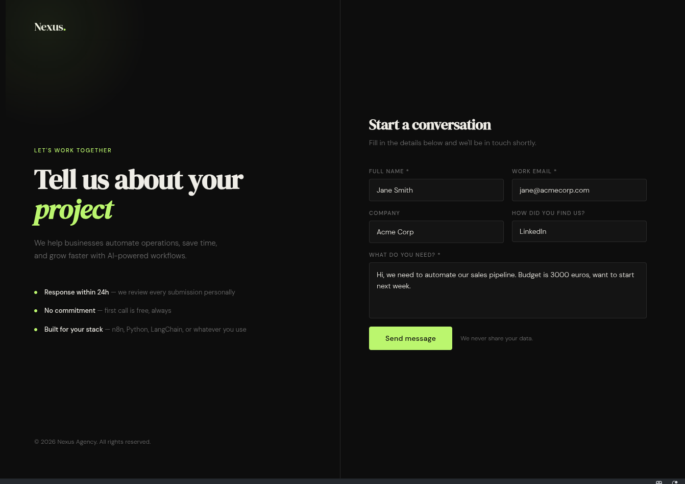
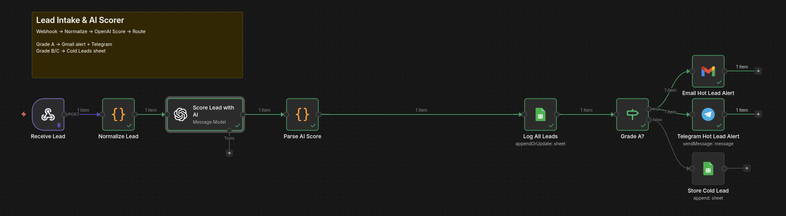
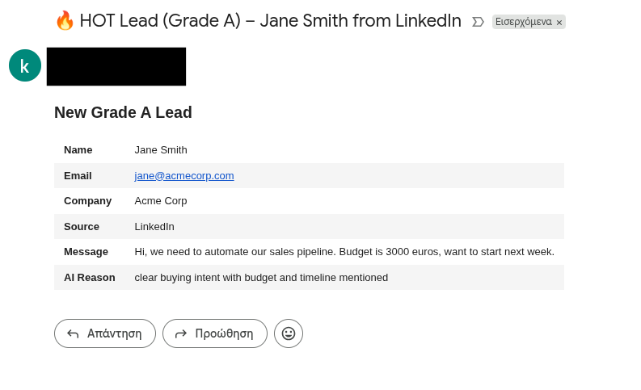
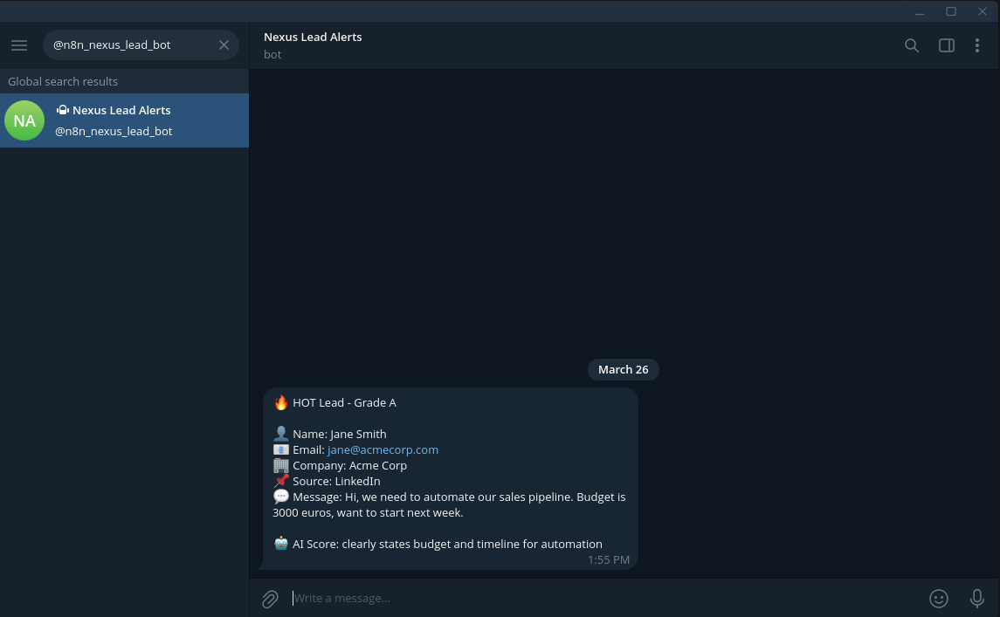
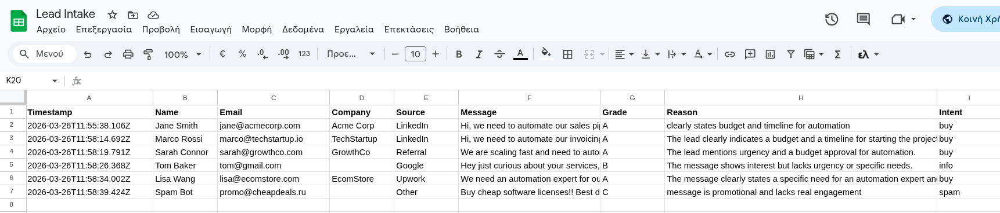
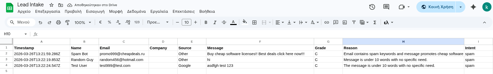
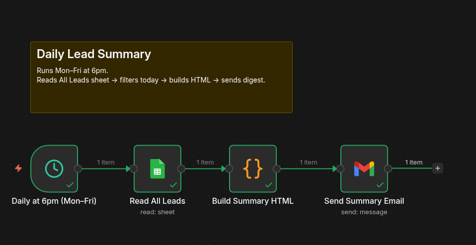
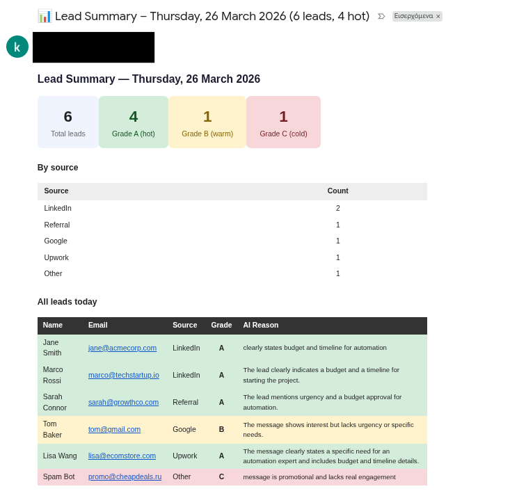

# 01 — Lead Intake & AI Scorer


Automated lead capture pipeline built with n8n and OpenAI. Receives leads from a web form, scores them with GPT-4o-mini (grade A/B/C), routes hot leads to Gmail + Telegram instantly, logs every lead to Google Sheets (deduplicated by email — a repeat submission updates the existing row instead of adding a duplicate), and sends a daily HTML digest at 6pm.

> **Why it matters:** hot leads reach a human the moment they arrive — cutting time-to-response
> from hours to seconds, when a prospect is most likely to convert. The scoring model
> (GPT-4o-mini) is swappable for any provider n8n supports (Anthropic/Groq/Gemini/Ollama) via
> its chat-model nodes, so it fits whatever stack or budget a client runs on.

## Workflows

| File | Trigger | What it does |
|------|---------|--------------|
| `Lead Intake & AI Scorer.json` | Webhook (form submit) | Score -> route -> notify |
| `Lead Daily Summary Email.json` | Schedule (6pm Mon-Fri) | Read sheet -> build HTML -> send digest |

## Tech stack

- **n8n** (self-hosted, Docker)
- **OpenAI** GPT-4o-mini - lead scoring
- **Google Sheets** - lead storage
- **Gmail** - hot lead alerts + daily digest
- **Telegram** - instant hot lead notification

## Flow

```
Form submit
    │
    ▼
Webhook -> Normalize -> OpenAI Score
                            │
                    ┌───────┴────────┐
                 Grade A          Grade B/C
                    │                │
             Gmail + Telegram    Google Sheets
                    │                │
                    └───────┬────────┘
                            │
                      Log -> All Leads sheet (upsert on Email — one row per lead)
```

## Daily digest

A second workflow (`Lead Daily Summary Email.json`) runs on a cron schedule — **18:00 Mon–Fri**, in the n8n instance's timezone. It reads the `All Leads` tab, filters to today's rows (timestamp ≥ midnight), and builds an HTML email with:

- **Headline counters** — total leads today + per-grade counts (A / B / C).
- **By-source table** — today's leads grouped by `Source`, sorted by count.
- **Full leads table** — every lead from today, row-coloured by grade (green / amber / red), with name, email, source, grade, and the AI's one-line reason.

If no leads arrive, the email still sends with *"No leads today"* placeholders — a heartbeat that confirms the pipeline is alive. It goes through the same Gmail credential as the hot-lead alerts.

```
[18:00 Mon–Fri]
      │
      ▼
Schedule -> Read All Leads -> Filter to today -> Build HTML -> Send Summary Email
```

## Demo

### Lead capture form

*The web form leads submit — sends a POST to the n8n webhook.*

### n8n workflow canvas (main scorer)

*Webhook → normalize → GPT-4o-mini scoring → route hot vs. cold → notify + log.*

### Hot lead alert (Gmail)

*Grade A leads trigger an instant email with the AI's grade and reasoning.*

### Hot lead alert (Telegram)

*The same hot lead, pushed to Telegram for instant mobile notification.*

### Lead storage (Google Sheets)

*Every lead is logged to the `All Leads` tab with grade, reason, and intent.*


*Grade B/C leads are filed in the `Cold Leads` tab for later follow-up.*

### n8n workflow canvas (daily summary)

*A scheduled workflow reads the sheet at 6pm and builds the digest.*

### Daily digest email

*An HTML summary of the day's leads with a grade breakdown, in your inbox at 6pm.*

## Setup

### 1. Google Sheets

Create a spreadsheet with two tabs:

**Tab 1 - `All Leads`**
```
Timestamp | Name | Email | Company | Source | Message | Grade | Reason | Intent
```

**Tab 2 - `Cold Leads`**
```
Timestamp | Name | Email | Company | Source | Message | Grade | Reason
```

Copy the Sheet ID from the URL:
`https://docs.google.com/spreadsheets/d/THIS_PART_HERE/edit`

> **Storage is swappable.** Google Sheets keeps the demo zero-infra and lets a client read and
> edit leads directly. For higher volume or production use, swap the Sheets nodes for n8n's
> **Postgres / Supabase** nodes — the rest of the pipeline (scoring, routing, alerts) is
> unchanged.

### 2. Import workflows

In n8n: **Settings -> Import** -> import each JSON file from the `workflows/` folder separately.

### 3. Replace placeholders

Search both files for these and replace:

| Placeholder | Replace with |
|-------------|-------------|
| `YOUR_SHEET_ID` | Your Google Sheet ID |
| `YOUR_EMAIL@gmail.com` | Your Gmail address |
| `YOUR_TELEGRAM_CHAT_ID` | Your Telegram chat ID |

> **Getting your Telegram chat ID:** Message [@userinfobot](https://t.me/userinfobot) on Telegram - it replies with your chat ID instantly.

### 4. Add credentials in n8n

Each node that connects to an external service needs credentials:
- **OpenAI node** - add your OpenAI API key
- **Google Sheets nodes** - connect via Google OAuth
- **Gmail nodes** - connect via Google OAuth (same account)
- **Telegram node** - add your Bot Token (create one via [@BotFather](https://t.me/BotFather))

### 5. Connect the form

Open `form/index.html` and replace the webhook URL on line:
```js
const WEBHOOK_URL = 'https://YOUR-N8N-INSTANCE/webhook/lead-intake';
```

If running n8n locally, use [ngrok](https://ngrok.com) to expose it:
```bash
ngrok http 5678
# copy the https URL -> paste into WEBHOOK_URL
```

### 6. Activate

- Turn on **both** workflows in n8n (toggle top right)
- Open `form/index.html` in a browser
- Submit a test lead with a message like: *"Hi, I need to automate my invoicing, budget is €2k, can we start next week?"*

**Expected result:**
- Gmail: hot lead alert email arrives within seconds
- Telegram: notification with lead details
- Google Sheets: row added to All Leads
- At 6pm: summary email with grade breakdown

## Customizing the AI scoring

The scoring logic lives in the **system prompt** of the OpenAI node. Edit it to match your business:

```
Grade A: mention of budget, timeline, or specific pain point
Grade B: general interest, no urgency
Grade C: spam, test submissions, no real message
```

For example a law firm might add:
```
Grade A also if: mentions "urgent", "court date", "contract", "deadline"
```

## Swapping the LLM provider

The scoring chain uses one **OpenAI Chat Model** node. To swap providers, delete it and drop in a **Groq Chat Model** node, set the model to `llama-3.3-70b-versatile`, attach a Groq credential, and reconnect it to the scoring step. Anthropic, Gemini, and Ollama work the same way — only the model node changes; the rest of the pipeline (webhook → normalize → score → route → Gmail + Telegram + Sheets) is untouched. Run it locally with Ollama and the scoring step costs nothing.

## Testing without the form

Send a test POST directly with curl:

```bash
curl -X POST https://YOUR-N8N-INSTANCE/webhook/lead-intake \
  -H "Content-Type: application/json" \
  -d '{
    "name": "Jane Smith",
    "email": "jane@acme.com",
    "company": "Acme Corp",
    "source": "LinkedIn",
    "message": "Hi, we need to automate our onboarding process. Budget is around 3k euros, looking to start next month."
  }'
```

## Demo form

A styled contact form is included in `form/index.html`. Deploy free on GitHub Pages:

1. Push this repo to GitHub
2. Go to **Settings -> Pages -> Source -> main branch**
3. Your form is live at `https://yourname.github.io/ai-automation-portfolio/01-lead-intake/form`

## Known limitations

- **Webhook needs a public URL** — a locally-hosted n8n must be exposed (e.g. ngrok) for the
  form to reach it; the free ngrok URL changes on restart. For production, deploy n8n on a VPS
  (Hetzner / DigitalOcean) or use **n8n Cloud** — both give you a stable URL out of the box.
- **No automatic retry on LLM failure** — if the OpenAI call times out or errors, that lead is
  logged without a grade. n8n's per-node *Retry On Fail* setting (e.g. 3 retries, 2s delay)
  closes this in one click on the `OpenAI Score` node; it's off in the demo to keep the canvas
  readable.
- **Scoring is prompt-based, not a trained model** — grades come from GPT-4o-mini following a
  system prompt, so quality depends on the prompt and the lead's message; there's no
  historical-conversion learning.
- **Single timezone for the digest** — the 18:00 summary fires at one fixed time for everyone.
- **Running cost.** GPT-4o-mini scores each lead in ~600 tokens, costing roughly **$0.0001 per lead** — about **$1 per 10,000 leads**. The daily digest is a Sheets read + HTML build (no LLM call), essentially free. Swap to Ollama locally and the per-lead cost drops to zero.

## Contact

Built by Konstantinos Arvanitis — AI engineer & automation specialist.

- [LinkedIn](https://www.linkedin.com/in/konstantinos-arvanitis-0248b3246/)
- [GitHub](https://github.com/k-arvanitis)
- Email: konstantinos.arvanitis@outlook.com
