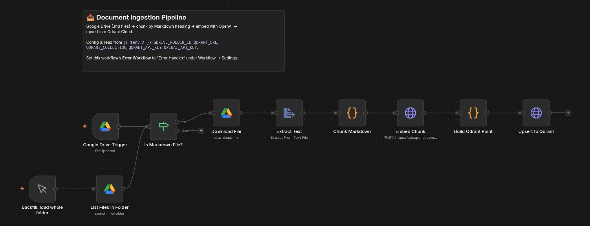
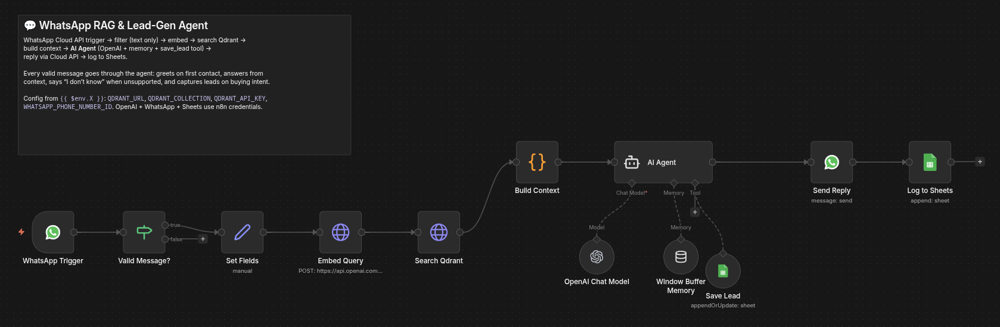
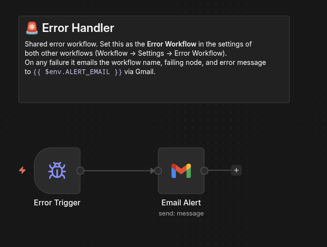
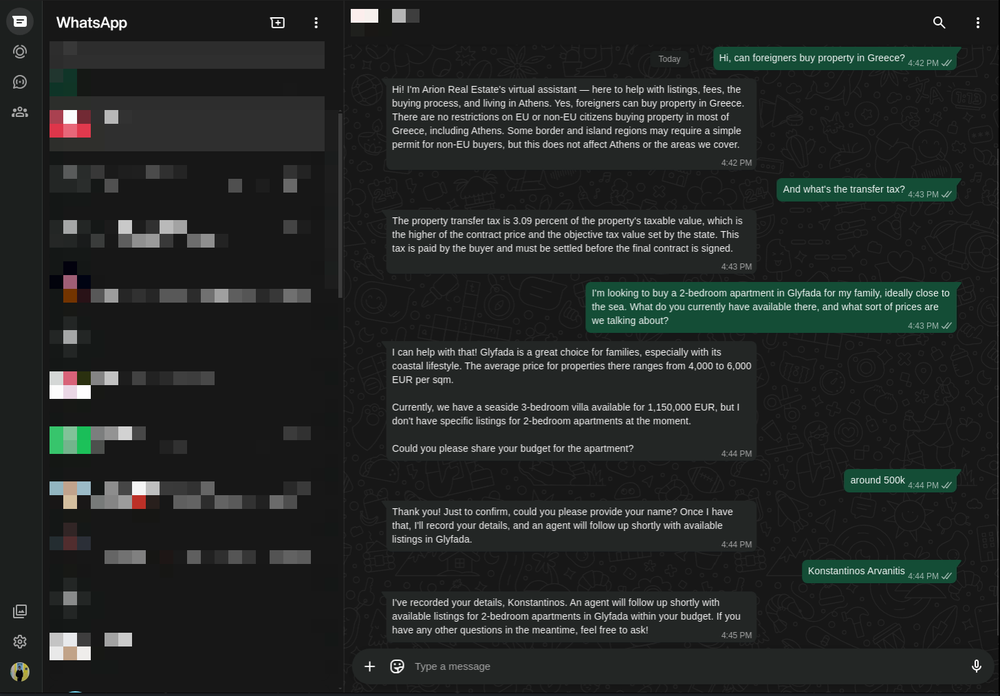
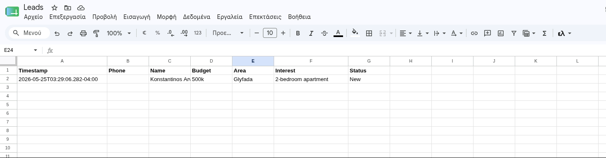
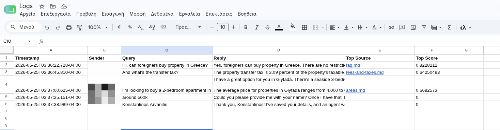

# 04 — WhatsApp RAG & Lead-Gen Agent


**A WhatsApp agent that does two jobs at once: it answers customers and it captures leads.** A real estate agency gets the same 30 questions every week — Golden Visa threshold, mortgages for foreigners, transfer tax, what's available in Glyfada — and it also gets buyers who are ready to act. This agent answers the questions instantly, 24/7, grounded in the agency's own documents, **and** when a customer shows buying intent it collects their details and drops a qualified lead straight into the agency's sheet. One conversation flows naturally between the two.

> **Why it matters:** the bot does the work of a front desk *and* a lead catcher. On the support side it deflects the repetitive questions so agents spend their time on viewings, not on copy-pasting the same fee breakdown — and because every answer is retrieved from the agency's own documents, it never invents a price or a legal detail. On the sales side it does what an FAQ bot never could: it recognises a hot buyer at 11pm, qualifies them (name, budget, area, property), and logs the lead before it goes cold. Answering questions is table stakes; **capturing the lead is the revenue.**

It runs on OpenAI today (`text-embedding-3-small` for retrieval, `gpt-4o-mini` for the agent); the model layer is provider swappable to Groq, Anthropic, Gemini, or a local Ollama model — see [Customizing for your business](#customizing-for-your-business) for the concrete swap.

## How it works

Three workflows. Two do the work, one watches for failures.

### 1. Document Ingestion Pipeline

Turns the agency's Markdown documents into searchable vectors.

1. A Google Drive trigger fires when a file is added or updated in a watched folder.
2. An IF node keeps only `.md` files; anything else is ignored.
3. The file is downloaded and its text extracted.
4. A Code node splits the document on Markdown headings (`##` and `###`), so each chunk is one self-contained section with its heading kept as context. Sections shorter than 50 characters are skipped.
5. Each chunk gets a deterministic ID derived from its source file and position, so re-ingesting the same file overwrites the same vectors instead of creating duplicates.
6. The chunk text is embedded with OpenAI `text-embedding-3-small` (1536 dimensions).
7. The vector and its payload (text, source file, heading, chunk index) are upserted into a Qdrant Cloud collection.

### 2. WhatsApp RAG & Lead-Gen Agent

A single AI Agent that both answers questions and captures leads in one conversation.

1. The WhatsApp Trigger node receives every incoming message from the WhatsApp Business Cloud API webhook.
2. An IF node keeps only text messages, so delivery receipts and status callbacks are ignored.
3. A Set node pulls out the message text and the sender's number.
4. The question is embedded with the same OpenAI model used at ingestion, and Qdrant is searched for the most similar document chunks. A Code node assembles them into a context block (and tolerates a no-match: the agent simply has no context that turn).
5. **Everything flows into one AI Agent** (`gpt-4o-mini`) that has three capabilities wired in:
   - **Grounding** — it answers using only the retrieved context, and says "I don't have that information" rather than inventing anything.
   - **Memory** — a Window Buffer Memory keyed on the sender's number gives it the last few turns, so follow-ups like "and what about that one?" resolve correctly, and it greets only on the first contact.
   - **A `save_lead` tool** — when a customer shows buying intent, the agent collects their name, budget, area, and property of interest across as many turns as needed, then writes the lead to a Google Sheet (the phone number is captured automatically). Re-saving the same customer updates their row instead of duplicating it.
6. The agent's reply is sent back through the WhatsApp Business Cloud API.
7. Every exchange is logged to a `Logs` sheet (with the retrieved source and similarity score) for quality review; qualified leads land in a separate `Leads` sheet.

### 3. Error Handler

A shared error workflow set as the Error Workflow on both pipelines. On any failure it emails the workflow name, the failing node, and the error message to your alert address, so a broken ingestion or a downed API surfaces immediately instead of silently.

## Flow

### Document Ingestion Pipeline

```
Google Drive (file added/updated)
        |
        v
Is it a .md file?  --no-->  ignore
        | yes
        v
Download -> Extract text -> Chunk by heading -> deterministic ID
        |
        v
Embed (OpenAI) -> Upsert (Qdrant)
```

### WhatsApp RAG & Lead-Gen Agent

```
WhatsApp message -> Cloud API webhook -> WhatsApp Trigger
        |
        v
Text message?  --no (status/receipt)-->  stop
        | yes
        v
Extract text/sender -> Embed (OpenAI) -> Search Qdrant -> Build context
        |
        v
                +------------------ AI Agent (gpt-4o-mini) ------------------+
                |  • answers grounded in retrieved context                   |
                |  • Window Buffer Memory (per sender) for multi-turn        |
                |  • save_lead tool -> appendOrUpdate row in Leads sheet     |
                +------------------------------------------------------------+
        |
        v
Send reply via WhatsApp Cloud API -> Log exchange to Sheets
```

## Tech stack

| Component | Technology |
|---|---|
| Workflow automation | n8n (self-hosted, Docker) |
| WhatsApp channel | WhatsApp Business Cloud API (official, Meta-hosted) |
| Vector database | Qdrant Cloud |
| Embeddings | OpenAI `text-embedding-3-small` (1536-dim) |
| Agent / responses | OpenAI `gpt-4o-mini` via n8n AI Agent (provider swappable for Groq/Anthropic/Ollama) |
| Conversation memory | n8n Window Buffer Memory, keyed per sender |
| Lead capture | `save_lead` tool → Google Sheets `appendOrUpdate` (deduplicated on phone) |
| Document source | Google Drive (Markdown files) |
| Conversation log | Google Sheets |
| Error alerts | Email (Gmail) |

## Demo

### n8n workflow canvas (ingestion)

*Google Drive trigger to chunking to embedding to Qdrant upsert.*

### n8n workflow canvas (agent)

*One AI Agent with retrieved context, Window Buffer Memory, and the save_lead tool; reply via Cloud API, then log to Sheets.*

### n8n workflow canvas (error handler)

*Catches failures in either main workflow and emails an alert with the failed node, error message, and execution URL.*

### WhatsApp conversation

*One thread: a grounded answer from the agency's documents, then the agent detecting buying intent, collecting the customer's details, and confirming a follow-up.*

### Captured leads in Google Sheets

*Qualified leads written by the agent: phone, name, budget, area, and property of interest, deduplicated per customer.*

### Conversation log in Google Sheets

*Every exchange logged with the retrieved source and similarity score for quality review.*

## What gets captured

**Every answered message** is appended to the `Logs` sheet:

| Column | Example |
|---|---|
| Timestamp | 2026-05-22T09:42:10.000Z |
| Sender | 306941234567 |
| Query | What is the Golden Visa threshold? |
| Reply | The Golden Visa minimum investment is 800,000 EUR in Athens and other high-demand areas... |
| Top Source | faq.md |
| Top Score | 0.83 |

The Top Source and Top Score columns make retrieval quality auditable: if answers drift, you can see exactly which document and how strong a match each reply was built from.

**Qualified leads** are written by the agent to the `Leads` sheet (one row per customer, updated as more detail comes in):

| Column | Example |
|---|---|
| Timestamp | 2026-05-22T09:46:02.000Z |
| Phone | 306941234567 |
| Name | Maria Papadopoulou |
| Budget | around 400k |
| Area | Glyfada |
| Interest | 2-bedroom |
| Status | New |

This is the difference between an FAQ bot and a lead-gen system: the agent doesn't just answer, it qualifies and hands sales a ready-to-call lead.

## Qdrant collection setup

Create the collection once before the first ingestion run. With `QDRANT_URL` and `QDRANT_API_KEY` exported in your shell:

```bash
curl -X PUT "$QDRANT_URL/collections/$QDRANT_COLLECTION" \
  -H "api-key: $QDRANT_API_KEY" \
  -H "Content-Type: application/json" \
  -d '{"vectors": {"size": 1536, "distance": "Cosine"}}'
```

Size `1536` matches `text-embedding-3-small`. If you swap the embedding model, change the size to match (for example `3072` for `text-embedding-3-large`).

## Setup

### Prerequisites

- Docker and Docker Compose
- A Qdrant Cloud account (free tier is enough)
- An OpenAI account, set as an n8n OpenAI credential (used for both embeddings and the agent)
- A Google account (Drive folder for documents, Sheet for the log and leads, Gmail for error alerts)
- A Meta Developer account with a WhatsApp Business app (the free test number is enough to demo)
- ngrok or any public HTTPS tunnel, so Meta's webhook can reach the n8n trigger

### Steps

1. Copy `.env.example` to `.env` and fill in every value.
2. Start n8n: `docker compose up -d`. This brings up n8n on port 5678.
3. Start a public tunnel to n8n, for example `ngrok http 5678`, and set `WEBHOOK_URL` in `.env` to the resulting HTTPS URL, then restart n8n.
4. Create the Qdrant collection with the curl command above.
5. Create a Google Drive folder for the documents and copy its ID into `GDRIVE_FOLDER_ID`. Upload the six files from `docs/` (or your own Markdown).
6. Create a Google Sheet with **two tabs**: `Logs` (header `Timestamp | Sender | Query | Reply | Top Source | Top Score`) and `Leads` (header `Timestamp | Phone | Name | Budget | Area | Interest | Status`). Note the spreadsheet ID.
7. In the Meta dashboard (developers.facebook.com), create a Business app, add the WhatsApp product, and open WhatsApp, API Setup. Note the **Phone number ID** and **WhatsApp Business Account ID**, generate an access token, and add your own number under "To" as a verified test recipient. Put the Phone number ID in `WHATSAPP_PHONE_NUMBER_ID` in `.env` and restart n8n.
8. In n8n (`http://localhost:5678`), import all three workflows from `workflows/` (Workflows, Import from File).
9. Add the credentials in n8n and attach them to the relevant nodes (n8n stores these in its own credential vault, not in any file):

    | Credential | Used by |
    |---|---|
    | Google Drive OAuth2 | `Google Drive Trigger`, `Download File` (ingestion) |
    | Google Sheets OAuth2 | `Log to Sheets` and `Save Lead` (agent), plus set their document ID to your Sheet |
    | Gmail OAuth2 | `Email Alert` (Error Handler) |
    | OpenAI | `Embed Chunk` (ingestion), `Embed Query` and `OpenAI Chat Model` (agent) |
    | WhatsApp (access token + business account ID) | `Send Reply` (agent) |
    | WhatsApp Trigger (app ID + app secret + verify token) | `WhatsApp Trigger` (agent) |

    The Qdrant calls are plain HTTP Request nodes that read their config from `.env`, so they need no n8n credential. The OpenAI nodes use n8n's built-in OpenAI credential (the same one your other workflows use), so the key lives in n8n's vault, not in `.env`.
10. Open `Log to Sheets` and `Save Lead` in the agent workflow and set their document ID to your Google Sheet (the `Logs` and `Leads` tabs respectively).
11. Open the `WhatsApp Trigger` node and copy its production webhook URL. In the Meta dashboard, WhatsApp, Configuration, set that as the Callback URL, paste the same verify token you put in the trigger credential, and subscribe to the `messages` field.
12. In each of the two main workflows, open Workflow, Settings, Error Workflow and select `Error Handler`.
13. Activate the workflows in this order: `Error Handler` first, then `Document Ingestion Pipeline`, then `WhatsApp RAG & Lead-Gen Agent`.
14. Drop a Markdown file into the Drive folder to trigger ingestion, then message the WhatsApp number from your verified test number to test.

## Sample conversation to test

A single thread that exercises both halves — grounded answers, memory, and lead capture:

1. **Hi, can foreigners buy property in Greece?** — greeting + grounded answer from `faq.md`
2. **And what's the transfer tax?** — answer from `fees-and-taxes.md` (the "and" proves memory)
3. **Do you have anything in Glyfada?** — pulls the Glyfada listing from `listings.md`
4. **I'm interested, my budget is around 500k** — the agent detects buying intent and asks for the name
5. **Maria Papadopoulou** — the agent saves the lead and confirms a follow-up

A new row appears in the `Leads` sheet after step 5.

## Customizing for your business

This is a template for any business that answers the same questions over and over *and* wants to capture leads: a clinic (services, insurance, then book a consult), a law firm (practice areas, fees, then intake a case), a hotel, a car dealership, a tour operator. To adapt it:

- **Replace the documents.** Swap the files in `docs/` for your own Markdown, structured with `##` and `###` headings (the chunker splits on them). Upload them to the Drive folder; ingestion handles the rest.
- **Edit the system prompt.** In the `AI Agent` node, change the agency name, tone, the fallback contact line, and what counts as "buying intent" / which lead fields to collect. This is the only place the business identity and qualification logic live.
- **Tune retrieval.** Adjust `limit` (how many chunks) and `score_threshold` (how strict the match must be) in the `Search Qdrant` node. The default `0.4` suits `text-embedding-3-small`; raise it for stricter matching, lower it to surface more context.
- **Tune memory.** The `Window Buffer Memory` node keeps the last 10 turns per sender. Raise it for longer context at a higher token cost, or lower it to keep replies cheap and focused.
- **Route leads further.** The `save_lead` tool writes to a sheet today. Point it at HubSpot/Pipedrive, or add a parallel Gmail/Telegram node, to alert a human agent the instant a hot lead is captured (the same pattern as the lead-intake project in this repo).
- **Add PDF support.** The ingestion pipeline reads Markdown today. To accept PDFs, route the download through n8n's Extract from File node in PDF mode before the chunker.
- **Swap the LLM provider.** In the agent workflow, delete the **OpenAI Chat Model** sub-node feeding the `AI Agent` and drop in the **Groq Chat Model** node instead, set the model to `llama-3.3-70b-versatile`, attach a Groq credential, and reconnect it to the agent. Anthropic, Gemini, and Ollama work the same way — only the model node changes; retrieval, memory, the `save_lead` tool, and the WhatsApp reply path stay identical. Run it locally with Ollama and the agent's per-reply cost drops to zero.

## Known limitations

- **Demo uses Meta's free test number, which is gated.** The Cloud API test number can message a handful of verified recipients, but after a few sends Meta returns error `131037` ("provided number needs display name approval") until the business completes verification and an approved display name. That is a Meta onboarding step, not a code issue — production uses a registered, verified business number and the n8n logic is identical; only the credential and sender number change.
- **24-hour service window.** The Cloud API lets a business reply freely for 24 hours after a customer's message. This agent is reactive (it answers inbound questions), so it stays inside that window by design; proactive outreach would need pre-approved message templates.
- **Lead detection is model judgment.** The agent decides when a message shows buying intent and when it has enough detail to call `save_lead`. It is tuned via the system prompt and works well in testing, but like any LLM-driven trigger it can occasionally capture early or ask one question too many. The dedup-on-phone write means a premature save is corrected, not duplicated, as the conversation continues.
- **Qdrant free tier limits.** The free cluster allows one collection and roughly 1GB, ample for a document base like this but not for millions of vectors.
- **Running cost.** OpenAI embeddings cost about 0.00002 USD per chunk, so ingesting an entire document base costs a fraction of a cent, and `gpt-4o-mini` replies are a small fraction of a cent each. Swapping the model to Groq or a local Ollama model drops the per-reply cost further if volume grows.
- **Google Drive trigger polling.** The trigger polls (default once a minute), so a newly added document is searchable within about a minute, not instantly.
- **In-memory conversation history.** The Window Buffer Memory lives in n8n's process, so a restart clears in-flight conversation context (the document knowledge in Qdrant and the captured leads in Sheets are unaffected). For durable memory across restarts, swap the buffer for a Postgres or Redis chat-memory node, both available in n8n.

## Contact

Built by Konstantinos Arvanitis, AI engineer and automation specialist.

- [LinkedIn](https://www.linkedin.com/in/konstantinos-arvanitis-0248b3246/)
- [GitHub](https://github.com/k-arvanitis)
